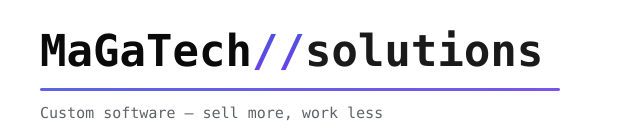

<picture>
  <source media="(prefers-color-scheme: dark)" srcset="./assets/logo-dark.svg" />
  <source media="(prefers-color-scheme: light)" srcset="./assets/logo-light.svg" />
  
</picture>

  

 

---

## `//` Quiénes somos

Somos un **estudio de tecnología mexicano** 🇲🇽 que construye soluciones a la medida — no plantillas. Del código al despliegue, el trabajo lo hacen directamente los fundadores, con **precios transparentes** y respuesta en menos de **24 horas**.

> We're a Mexican tech studio building custom software from scratch — websites, mobile apps, and enterprise systems designed to grow your business.

 

## `//` Qué hacemos

| | Servicio | |
|:--:|:--|:--|
| 🌐 | **Sitios web & landing pages** | Rápidos, responsivos y listos para convertir |
| 📱 | **Apps móviles** | iOS & Android desde una sola base |
| ⚙️ | **Software empresarial a la medida** | Sistemas que automatizan tu operación |
| 🛒 | **E-commerce** | Tiendas en línea con pagos integrados |
| 🔗 | **Automatización & integraciones** | Conecta tus herramientas y elimina el trabajo manual |
| 🧩 | **Consultoría & soporte técnico** | Acompañamiento en cada fase del proyecto |

 

## `//` Nuestro stack

  
  
  
  
  
  
  

  
  
  
  
  
  
  

 

## `//` Proyectos destacados

<table>
<tr>
<td width="50%" valign="top">

### 🏆 Goldesk
Plataforma **SaaS** completa con pagos, suscripciones y PWA.

`Next.js` · `NestJS` · `PostgreSQL` · `Stripe`

</td>
<td width="50%" valign="top">

### 💊 Farmacias ISSEG
**E-commerce** de farmacia con geolocalización y pagos.

`Angular` · `Tailwind` · `Google Maps` · `OpenPay BBVA`

</td>
</tr>
</table>

 

## `//` ¿Listo para empezar?

Cuéntanos tu idea y te respondemos en menos de 24 horas. Precios claros, pagos por etapas, sin sorpresas.

**Sitios web profesionales desde $3,999 MXN**

  

Hecho con ☕ y código en México · <code>MaGaTech // solutions</code>

